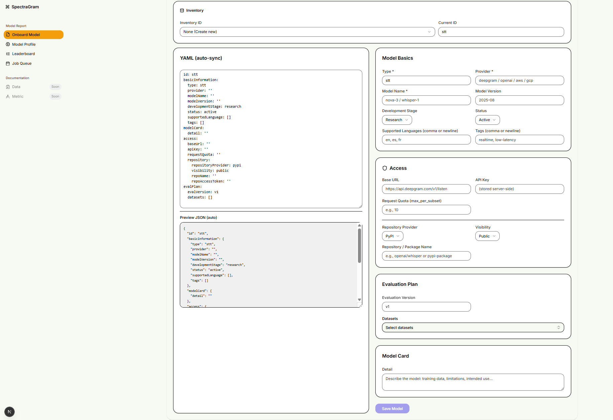
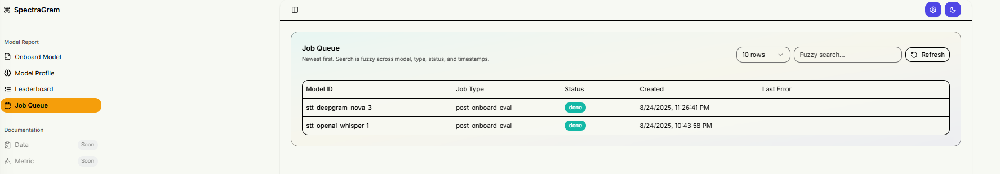
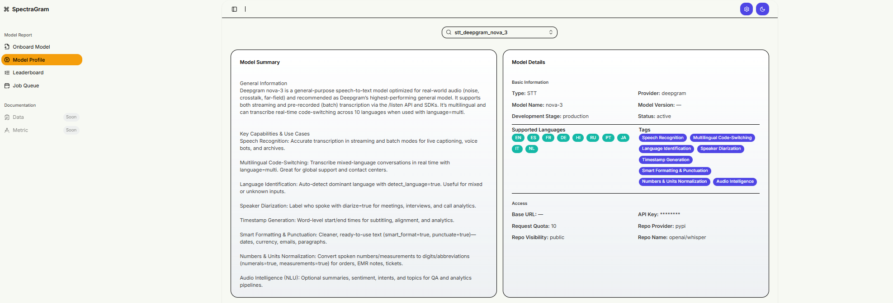
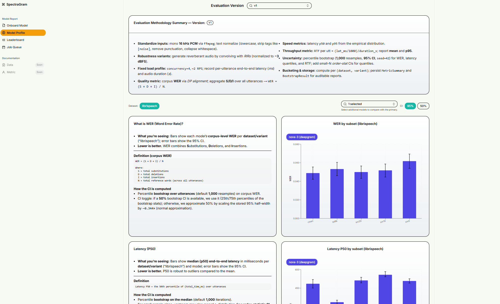
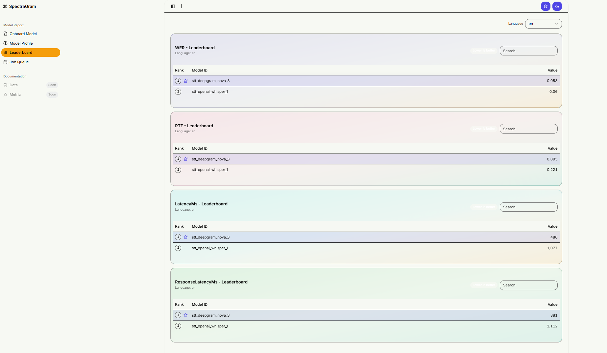

# SpectraGram (POC)

## Overview

SpectraGram standardizes speech model evaluation

Pluggable versioned evaluation plans (e.g., v1 WER/Latency/RTF with normalization)

Apples-to-apples comparisons across providers/models/versions

Inventory & history so teams can see progress over time

# On Board Model

# Job Queue 

# Model Profile

# Evaluation 

# Leaderboard
